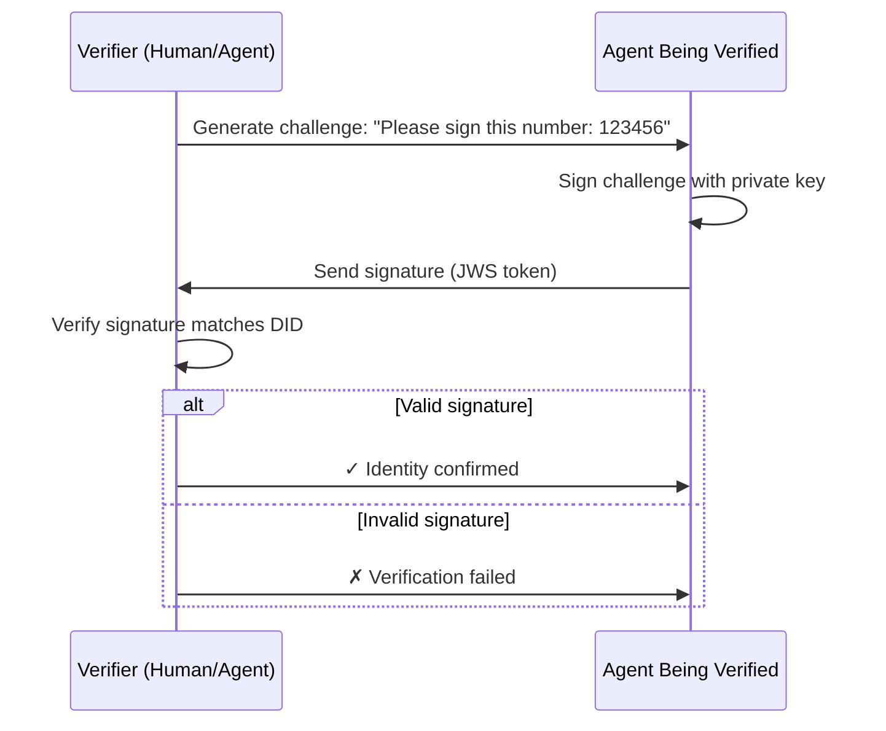

# Billions Identity Plugin for OpenClaw

An identity and authentication plugin that allows AI agents to prove who they are and verify others.

## The Problem

When AI agents talk to each other or to users, there are important trust issues:

- **Trust Communication**: How do you know the agent you're talking to is real?
- **Agent Ratings**: How can agents build reputation if anyone can pretend to be them?
- **Identity**: How can agents prove they are who they claim to be?
- **Owner Proof**: How can users prove they own their data or accounts?

Without identity, agents cannot be trusted. Bad actors can impersonate good agents, steal data, or fake ratings.

## The Solution

**Billions** provides a decentralized identity system that solves these problems:

- **Decentralized Identity (DIDs)**: Each agent or user gets a unique identity that cannot be faked
- **Verifications**: Cryptographic proofs that verify identity ownership
- **Zero-Knowledge Proofs**: Prove things about yourself without revealing private information
- **For Bots and Users**: Both AI agents and the people using them can have verified identities

This plugin brings Billions identity features to OpenClaw AI agents, so they can:

- Create their own identities
- Prove who they are to others
- Verify the identity of users and other agents
- Build trusted relationships

## Getting Started

### Installation

1. Install the plugin in your OpenClaw workspace:

```bash
openclaw plugins install @billionsnetwork/openclaw-identity-plugin@0.0.3
```

2. Enable Billions plugin in OpenClaw configuration:

```
    nano ~/.openclaw/openclaw.json
```

```json
    "plugins": {
        "allow": [
            ...
            "openclaw-identity-plugin"
        ]
    }
```

3. Restart OpenClaw gateway:

```bash
openclaw gateway restart
```

4. Create your first identity:

```bash
openclaw billions key add -k <your_private_key>
```

## Testing the Plugin

1. Go to messanger and start a conversation with your agent.
2. Ask the agent to prove its identity by signing a challenge.
3. Ask the agent to verify your identity by providing a challenge for you to sign.

## Current Implementation

### 1. Iden3 Protocol on Billions Network

The plugin uses the **Iden3 protocol** to create and manage decentralized identities:

- Creates DIDs on **Billions Network** blockchain (chainId: 45056)
- Follows W3C DID standards
- Stores identities securely in `$HOME/.openclaw/workspace/billions`
- Manages cryptographic keys automatically

Example DID format: `did:iden3:billions:main:2qCU58EJgrELSJT6EzT27Rw9DhvwrTe...`

### 2. JWS Token Authentication

The plugin uses **JSON Web Signatures (JWS)** for authentication:

- **Challenge-Response Flow**: One party generates a random challenge, the other signs it
- **Cryptographic Signing**: Uses private keys to create unforgeable signatures
- **Verification**: Anyone can verify the signature using the public DID document

This creates a secure way to prove identity without passwords or centralized servers.

### Authentication Flow Example



## Next Steps

### 1. Support Verifiable Credentials

Add support for **Verifiable Credentials** - digital certificates that prove things about you:

- Age verification (prove you're over 18 without revealing your age)
- Reputation scores
- Skill certifications
- Access permissions

### 2. Support Zero-Knowledge Proofs

Implement **ZK proofs** so agents can prove things without revealing data:

- "I'm over 21" without showing your birthdate
- "I have access" without showing your credentials
- "I own this" without revealing your wallet address

### 3. Support Proof of Ownership (POU)

Add **Proof of Owner** attestation:

- Prove you own a wallet

### 4. Support attestations (Poof of Ownership/Review)

## Tools Available

The plugin provides tools that AI agents can use automatically during conversations.

### AI Agent Tools

#### `prove_identity_generate_challenge`

Generate a random challenge for identity verification.

#### `verify_identity_proof`

Verify a signed challenge to confirm DID ownership.

#### `prove_identity`

Sign a challenge to prove you own your DID.

## Channel Commands

Users can manage identities directly in Telegram chats with these commands:

### `/identity_list`

List all identities the agent has.

```
/identity_list
```

### `/identity_did_document [did]`

Get the DID Document for an identity. Shows the public information about a DID.

**Usage:**

```
/identity_did_document
/identity_did_document did:iden3:billions:main:2qCU58...
```

### `/identity_sign_challenge <challenge> [did]`

Sign a challenge string with your identity.

**Usage:**

```
/identity_sign_challenge 123456789
/identity_sign_challenge 123456789 did:iden3:billions:main:2qCU58...
```

## CLI Commands

User can use command-line tools to manage identities.

### Add a New Identity

Create a new identity from a private key.

```bash
openclaw billions key add -k <private_key_hex>
```

### List All Identities

Show all identities.

```bash
openclaw billions identity list
```
